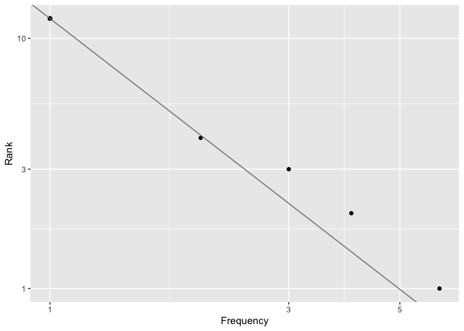

<!-- README.md is generated from README.Rmd. Please edit that file -->

# zipfs

<!-- badges: start -->
<!-- badges: end -->

------------------------------------------------------------------------

The zipfs pacakge contains functions to help fit Zipf’s Law to book
texts from the Gutenberg project.

## Installation

This package isn’t on CRAN, but you can install it from GitHub with:

``` r
# install.packages("remotes")
remotes::install_github("merely-useful/zipfs")
```

## Usage

``` r
library(zipfs)
text <- c("Star light, star bright,
    First star I see tonight;
    I wish I may, I wish I might,
    Have the wish I wish tonight.")
(word_freq <- count_words(text))
#> # A tibble: 12 x 2
#>    word        n
#>    <chr>   <dbl>
#>  1 i           6
#>  2 wish        4
#>  3 star        3
#>  4 tonight     2
#>  5 bright      1
#>  6 first       1
#>  7 have        1
#>  8 light       1
#>  9 may         1
#> 10 might       1
#> 11 see         1
#> 12 the         1
plot_rank(word_freq$n, add_fit = TRUE)
```



``` r
fit_zipfs(word_freq$n)
#> [1] 0.6458106
```

## Curated R History

This wouldn’t be in the pacakge README, but trying to keep it around in
case it is useful.

An attempt to keep track of the R code run on the Console in the act of
creating the package.

### Add dracula data

``` r
use_data_raw("dracula")
# Edit data-raw/dracula.R
# Source data-raw/dracula.R
devtools::load_all(".")
dracula # Check data available
use_r("dracula")
# Add data docs to R/dracula.R
devtools::document(".")
?dracula # Check docs
```

### Add book meta functions

``` r
use_r("book-meta")
# Edit R/book-meta.R to add functions
use_package("tibble")
use_package("stringr")
use_pipe()
devtools::load_all(".")
extract_element("Author: Bram Stoker", "Author")
book_meta(dracula[1:20])
# Code -> Insert Roxygen Skeleton
# Edit Roxygen comment for `book_meta()`
devtools::document()
?book_meta
```

### Add `count_words()`

``` r
use_r("count")
# Edit count.R
devtools::load_all(".")
count_words(dracula)
# Code -> Insert Roxygen Skeleton
# Edit Roxygen comment for `count_words()`
devtools::document()
?count_words
```

### Add license

``` r
use_mit_license("Charlotte Wickham")
```

### Add plot function

``` r
use_r("plot")
# Edit R/plot.R
devtools::load_all(".")
plot_rank(1:100)
# Insert ROcygen skeleton
# Edit roxygen comment for `plot_rank()`
devtools::document()
?rank
word_freqs <- count_words(dracula)
plot_rank(work_freqs$n)
```

### Add fit function

``` r
use_r("fit")
# Edit R/fit.R
devtools::load_all(".")
word_freqs <- count_words(dracula)
fit_zipfs(word_freqs$n)
use_test()
# Edit tests/testthat/test-fit.R
devtools::test()
devtools::document()
# Edit Roxygen comment for `fit_zipfs()`
?fit_zipfs
```

### Update plot function to take `add_fit` argument

``` r
use_r("plot") # quick way to open file
# Edit `plot_rank()` code and docs
devtools::load_all()
plot_rank(word_freqs$n, add_fit = TRUE)
?plot_rank
```

### More tests for `book_meta()`

``` r
use_test("book-meta")
# Edit tests, running expectation as I go
devtools::test()
use_r()
# Add input check to `book_meta()`
devtools::test()
```

### Getting pkgdown website

``` r
usethis::use_pkgdown()
pkgdown::build_site()
# Preview and edit DESCRIPTION, README etc.
usethis::use_github_pages()
usethis::use_github_action("pkgdown")
# Commit and Push
```
